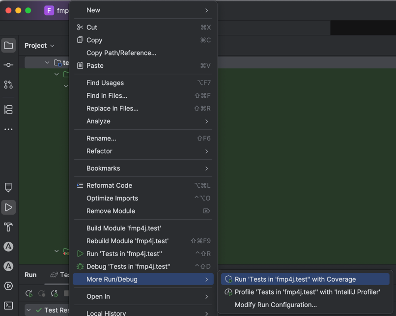

# CONTRIBUTING

Thanks for your interest in contributing! Follow these steps to get started.

- **Read the README**: Know what the project does and what it's for.
- **Check open issues**: Look for existing bugs or features.
- **Ask before building**: Open an issue or comment to avoid duplicate work.

## 🛠️ How to Contribute

1. Fork the repo
2. Set up the project — see [docs/DEVELOPMENT.md](docs/DEVELOPMENT.md)
3. Create a new branch — use clear short names
4. Push and open a Pull Request (PR) to `master`

## ✅ Pull Request Checklist

- [x] Commits are prefixed with issue number (e.g., `#3 Create FmpHttpClient`)
- [x] Code follows existing style/conventions
- [x] No unrelated changes in your PR
- [x] Follow TDD, 100% test coverage
- [x] Apply DDD principles

## 💬 Need Help?

Open an issue or ask in discussions. We’re happy to help.

---

## Testing

Please see existing tests for examples.

* Test names
  * snake case
  * clear and descriptive
  * do not start with `test_` or `should_`
* BDD comment blocks
  * `// given`
  * `// when`
  * `// then`
* Run tests with coverage in IntelliJ, make sure all paths are covered

